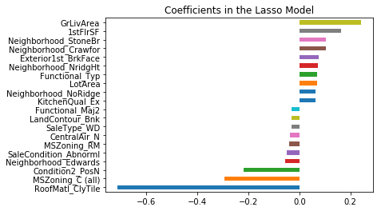

# PHBS_ML_Project

Project Proposal
House Price Prediction

[1]. Wang Tianqi 1401213465
[2]. Matta Uma Maheswara Reddy 1601213442 

    
## Project Description

This is a Kaggle Competition to predict housing sale prices using advanced regression techniques. There are 79 variables that can be used for predicting the housing prices. We plan to implement various techniques we have learned in the class and try to predict the housing prices.

## Project Goal

Our job is to predict the sales price for each house, which is stored in ‘SalePrice’ column, and try to minimize the Root-Mean-Squared-Error (RMSE).
                                                
## Data Description

All the data are provided from Kaggle, which has already been separated into train dataset (with 1460 observations) and test data (with 1459 observations). There are 79 features which are used in predicting the prices, including 36 numerical features and 43 categorical features. Here are the data description: 

Feature | Description
---------|-----------
MSSubClass  | Identifies the type of dwelling involved in the sale.
MSZoning    | Identifies the type of dwelling involved in the sale.
LotFrontage | Linear feet of street connected to property
LotArea| Lot size in square feet
Street| Type of road access to property
Alley| Type of alley access to property	
LotShape|General shape of property
LandContour|Flatness of the property
Utilities|Type of utilities available
LotConfig|Lot configuration	
LandSlope|Slope of property	
Neighborhood| Physical locations within Ames city limits		
Condition1| Proximity to various conditions	
Condition2|proximity to various conditions (if more than one is present)
BldgType|Type of dwelling
HouseStyle| Style of dwelling
OverallQual| Rates the overall material and finish of the house
OverallCond|Rates the overall condition of the house	
YearBuilt|Original construction date
YearRemodAdd| Remodel date (same as construction date if no remodeling or additions)
RoofStyle|Type of roof	
RoofMatl|Roof material
Exterior1st| Exterior covering on house
Exterior2nd|Exterior covering on house (if more than one material)	
MasVnrType|Masonry veneer type	
MasVnrArea| Masonry veneer area in square feet
ExterQual|Evaluates the quality of the material on the exterior 		
ExterCond| Evaluates the present condition of the material on the exterior		
Foundation|Type of foundation		
BsmtQual|Evaluates the height of the basement		
BsmtCond| Evaluates the general condition of the basement	
BsmtExposure| Refers to walkout or garden level walls	
BsmtFinType1|  Rating of basement finished area		
BsmtFinSF1| Type 1 finished square feet
BsmtFinType2| Rating of basement finished area (if multiple types)
BsmtFinSF2| Type 2 finished square feet
BsmtUnfSF| Unfinished square feet of basement area
TotalBsmtSF| Total square feet of basement area
Heating|Type of heating	
HeatingQC| Heating quality and condition	
CentralAir| Central air conditioning	
Electrical| Electrical system
1stFlrSF|First Floor square feet
2ndFlrSF| Second floor square feet
LowQualFinSF| Low quality finished square feet (all floors)
GrLivArea| Above grade (ground) living area square feet
BsmtFullBath| Basement full bathrooms
BsmtHalfBath| Basement half bathrooms
FullBath|Full bathrooms above grade
HalfBath|Half baths above grade
Bedroom|Bedrooms above grade (does NOT include basement bedrooms)
Kitchen| Kitchens above grade
KitchenQual| Kitchen quality      	
TotRmsAbvGrd| Total rooms above grade (does not include bathrooms)
Functional| Home functionality (Assume typical unless deductions are warranted)		
Fireplaces| Number of fireplaces
FireplaceQu| Fireplace quality		
GarageType| Garage location		
GarageYrBlt| Year garage was built	
GarageFinish| Interior finish of the garage
GarageCars| Size of garage in car capacity
GarageArea| Size of garage in square feet
GarageQual|Garage quality
GarageCond|Garage condition
PavedDrive| Paved driveway
WoodDeckSF|Wood deck area in square feet
OpenPorchSF|Open porch area in square feet
EnclosedPorch|Enclosed porch area in square feet
3SsnPorch|Three season porch area in square feet
ScreenPorch| Screen porch area in square feet
PoolArea| Pool area in square feet
PoolQC| Pool quality		
Fence| Fence quality	
MiscFeature| Miscellaneous feature not covered in other categories		
MiscVal| $Value of miscellaneous feature
MoSold| Month Sold (MM)
YrSold| Year Sold (YYYY)
SaleType|Type of sale	
SaleCondition| Condition of sale

## Feature Engineering
For data cleaning and processing, we use following steps:
1. Some features have over 50%, we then deleted those 5 variables, and replace the missing value with the mean of the column
2. For those categorical data, we create dummies for them.
3. Since the regression would produce better prediction result for variables which are normal distributed, we log transforme those numerical data whose skewness is over than 1.

* Also, since there are still 74 features remained which could be too many and easy to be overfitting, we used three ways to reduce the feature numbers :
    * Checking the correlation and manually pick some features that are high correlated with SalePrice
    * Using Principal Component Analysis (PCA) method.
    * Using the linear regression with regularization.

So accordingly, we will use three dataset to test our model:
* All features
* Selected features
* PCA processed data

We will test the model based on all three datasets to assess the model.

## Methodology
Since the project is a regression problem, we tried some advanced  regression techniques based on algorithms.
* Linear regression
* Decision tree regression
* Random forest regression
* Gradient boosting regression
* Linear regression with regularization (LASSO, Ridge)

## Result
The regression result on three data set using different models are listed below.

Model | All Feature | PCA | Selected Feature
-------|-----------|-------|------------------
Linear Regression|0.14031|0.14865|0.17700
Gradient Boosting | 0.12557|0.18355|0.17320
Decision Tree |0.20608|0.30176|0.23450
Random Forest | 0.15104|0.21528|0.18317
Ridge |0.12829|0.14871|0.17700
Lasso |0.12304|0.14842|0.17705

We can see the Lasso fit best, and we can take a look at what features this model choose and the importance of selected features.

The most important positive feature is GrLivArea - the above ground area by area square feet. 

